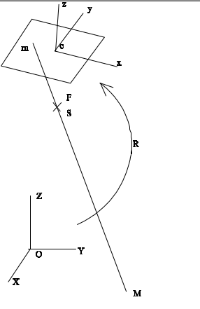

# Documentation for the function space_resection in src/transform_world_image/transform_shot/space_resection.py

Function to re/calculate the 6 external image parameters. 3 parameters for image position and 3 parameters for orientation angles omega, phi, kappa, per least square.

It is built in the src.transform_world_image.transform_worksite.spaceresection.py module.

## Functions

There are two main functions in this class.
* One for spatial bearing on images whose parameters are already known, where you can add a deviation to the image point position if you wish to offset an image. Function is [space_resection_on_worksite()](#f1).
* The other allows you to calculate the 6 external parameters of an acquisition using the coordinates of points present on the image and in the field. Function is [space_resection_to_worksite()](#f2).

## Parameters for space_resection_on_worksite() <a name="f1"></a>

It takes in parameters :
1. **work**: A worksite object with instantiate shot.
2. **add_pixel**: Pixel to be added to the change maker.

For instantiate a worksite correctly look [doc python](./../../README_python_lib.md).

The **add_pixel** object is a tuple of dimension 2, **used to add a number of pixels in columns and rows**. Used to convert certain photogrammetric data formats.

Object to instantiate before calculation, if the data have different types and are corrected by linear alteration :

* The **Dtm** allows a first estimate z terrain, and converts the data they have linear alteration.

* The **ProjEngine** object is defined by a string giving the ESPG code of the site's map projection, e.g. 2154, followed by a list of pyproj GeoTIFF of geoid.

  These GeoTIFFs represent the geoid grid on the site. They can be found on the PROJ-data github (https://github.com/OSGeo/PROJ-data/tree/master ) and will be used by pyproj to calculate the acquisition altitude (so as not to take into account corrections already made to the acquisition coordinates in the original data). For it to be taken into account, it must be added to a proj folder. If you're not using an environment, the path is usr/share/proj; if you are using an environment, the path is env_name_folder/lib/python3.10/site-packages/pyproj/proj_dir/share/proj.


### Data initialization, l_obs, x0

* Inatialization of 20 points for shooting positions
```
c_obs, l_obs, z_world = seed_20_point(cam)
```
Function to give the position of 20 points in the image at a fixed world height. The positions of the points are fixed and set by percentages for any image size. They will be the $c_{obs}$ and $l_{obs}$ observation data.  
Distribution of the 20 points in the image with z given.
```
                               widht
        -------------------------------------------------- 0%
        |                 *                       * 450  | 10%
        |     *          335    *        *     *         | 20%
    h   |    320       *       350      370   400        | 30%
    e   |             330          *                 *   | 40%
    i   |                 *       360       *       500  | 50%
    g   |        *       340          *    380           | 60%
    h   |       250          *       360          * 400  | 70%
    t   |  *                330          * 355           | 80%
        | 200       * 240             * 350      300 *   | 90%
        -------------------------------------------------- 100%
        0%          25%         50%          75%          100%
```

* Calculates terrain position and Euclidean position
```
# Calculate world position
x_world, y_world, _ = shot.image_to_world(c_obs, l_obs, cam, projeucli, z_world)

# Calculate euclidean position
x_eucli, y_eucli, z_eucli = projeucli.world_to_euclidean(x_world, y_world, z_world)
```
The calculation is performed in a Euclidean reference frame (local tangent).

* Add factor
```
c_obs += add_pixel[0]
l_obs += add_pixel[1]
```
Enables data format conversion when different from 0

* Initialization of a new acquisition that will be modified, represents $x0$
```
shot_adjust = Shot(shot.name_shot, shot.pos_shot, shot.ori_shot, shot.name_cam)
shot_adjust.set_param_eucli_shot(projeucli)
```

## Parameters for space_resection_to_worksite() <a name="f2"></a>

It takes in parameters :
1. **work**: A worksite object with instantiate camera and no shot.
2. **pt2d**: DataFrame with image point.
3. **pt3d**: DataFrame with ground point.
4. **pinit**: Dictionary with the initialization point.

The **worksite** must be created with a name ```work = Worksite("Test")```, and needs 4 additional data:
* One camera with ```read_camera(["./dataset/Camera1.txt"], work)``` (All images must have the same camera).
* The data z unit given as input to the function ```work.type_z_data = "height"```.
* The z unit of the acquisitions to be output ```work.type_z_shot = "altitude"```.
* The euclidean system you want to use  ```work.approxeucli = False```, False to use the ordinary system and True to use approximate system.

The DataFrame **pt2d** is a table with 4 column and n line. The id of column must be:
* `id_pt`: the id of the point
* `id_shot`: the name of the shot where the point is located
* `column`: column coordinate in pixel of the point in the image
* `line`: line coordinate in pixel of the point in the image
it can be created with the function `read_file_pt_dataframe(path_file_pt,header_file,"pt2d")`

The DataFrame **pt3d** is a table with 5 column and n line. The id of column must be:
* `id_pt`: the id of the point
* `type`: if point is gcp with type else None
* `x`: x coordinate in your projection system of the point
* `y`: y coordinate in your projection system of the point
* `z`: z coordinate in your projection system of the point
it can be created with the function `read_file_pt_dataframe(path_file_pt,header_file,"pt3d")`

The dictionary **pinit** which give the initialization point X, Y, Z. A point on the worksite with a z at an approximate flying height. The name of the key in the dictionary is `coor_init`.

Object to instantiate before calculation, if the data have different types and are corrected by linear alteration :

* The **Dtm** allows a first estimate z terrain, and converts the data they have linear alteration. ```work.set_dtm(path_dtm, unit_z_of_dtm)```

* The **ProjEngine** object is defined by a string giving the ESPG code of the site's map projection, e.g. 2154, followed by a list of pyproj GeoTIFF of geoid. ```work.set_proj(epsg, [path_geoid])```

  These GeoTIFFs represent the geoid grid on the site. They can be found on the PROJ-data github (https://github.com/OSGeo/PROJ-data/tree/master ) and will be used by pyproj to calculate the acquisition altitude (so as not to take into account corrections already made to the acquisition coordinates in the original data). For it to be taken into account, it must be added to a proj folder. If you're not using an environment, the path is usr/share/proj; if you are using an environment, the path is env_name_folder/lib/python3.10/site-packages/pyproj/proj_dir/share/proj.

### Data initialization

Data initialization is the initialization of an acquisition that will be adjusted by the points.
Each shot is initiated with its name, the position given as input, the angles omega, phi = 0 and kappa, an approximate angle calculated with the points (to avoid a divergence of the least squares if the initial solution is too far from the final solution), the name of the camera given as input, then more optional parameters that can be modified afterwards, in angle in degree, no linear correction and an angle axis "opk" for the rotation matrix. `Shot(name_shot, pinit["coor_init"], np.array([0, 0, pinit["kappa"]]),cam.name_camera, "degree", False, "opk")`

The number of points in the image is set to a minimum of 3 for calculation. If there are fewer, the image in question will not be calculated, and a message to that effect will be displayed in the console.

## Function and least squares

### Colinearity equation
<p align="center">  </p>

```math
M = \begin{pmatrix} X_M \\ Y_M \\ Z_M \end{pmatrix},~
S = \begin{pmatrix} X_S \\ Y_S \\ Z_S\end{pmatrix},~
F = \begin{pmatrix} x_c \\ y_c \\ p \end{pmatrix},~
m = \begin{pmatrix} x \\ y \\ 0 \end{pmatrix},~
K = \begin{pmatrix} 0 \\ 0 \\ 1 \end{pmatrix},~
R~the~rotation~matrix
```


m is image coordinate of M. K the unit vector orthogonal to the shot.

$m \in shot \Leftrightarrow K^tm = 0$ hence $\lambda = \frac{-K^tF}{K^tR(M-S)}$  
Let's set $A = M-S$ and $U = RA$, we have $\lambda=\frac{-K^tF}{K^tU}$ hence $m = F - \frac{K^tFU}{K^tU}$ 

The image formula used is: $$m = F - (K^T F U) / (K^T U)$$ 

### Differential relationship between m and beam parameters

The above equation is non-linear, and to solve the systems corresponding to analytical photogrammetry, it needs to be linearized. The variables to be taken into account are F,M,S and R.  
$dm = dF - \frac{K^tdFU}{K^tU} - (\frac{K^tF}{K^tU} - \frac{K^tFUK^t}{(K^tU)²})dU $  
$dU = R(dM-dS)+dRA = r(dM-dS-\tilde{A}d\Theta) $  
On the other hand, $K^tF$ being a scalar, $K^tFU = UK^tF$ and $K^tdFU = UK^tdF$
We have: $dm = \frac{K^tU-UK^t}{(K^tU)²}(K^tUdF-K^tFR(dM-dS-\tilde{A}d\Theta))$  
Let's set 
```math
p = K^tF,~
U = \begin{pmatrix} u1 & u2 & u3 \end{pmatrix}~and~
V = \begin{pmatrix} u3 & 0 & -u1 \\ 0 & u3 & -u2 \end{pmatrix}
```  

which results in: $$dm = \frac{V}{u3} dF + (\frac{p}{u3²}) V R (dS-dM) + (\frac{p}{u3²}) V R \tilde{A}d\Theta$$

### Construction of the matrix A of least squares

The matrix $mat_A$ depends on the function used and the number of data items. It is defined as $\frac{df}{dx}|_{x0}$, each column representing a derivative of $f(x)$ with respect to a parameter of x0, and the number of rows the number of data.  
$x0$ is the 6 externals parameters of the shot: 
```math
position~S = \begin{pmatrix}X_S \\ Y_S \\ Z_S\end{pmatrix}~and~orientation~ \Theta = \begin{pmatrix}\omega \\ \phi \\ \kappa\end{pmatrix} 
```
so:
```math
mat_A = \begin{pmatrix}
\frac{dfx1}{dX_S} & \frac{dfx1}{dY_S} & \frac{dfx1}{dZ_S} & \frac{dfx1}{d\omega } & \frac{dfx1}{d\phi } & \frac{dfx1}{d\kappa } \\
\frac{dfx2}{dX_S} & \frac{dfx2}{dY_S} & \frac{dfx2}{dZ_S} & \frac{dfx2}{d\omega } & \frac{dfx2}{d\phi } & \frac{dfx2}{d\kappa } \\
  ...   &   ...   &   ...   &   ...    &    ...   &    ...  \\
\frac{dfxn}{dX_S} & \frac{dfxn}{dY_S} & \frac{dfxn}{dZ_S} & \frac{dfxn}{d\omega } & \frac{dfxn}{d\phi } & \frac{dfxn}{d\kappa } \\
\frac{dfy1}{dX_S} & \frac{dfy1}{dY_S} & \frac{dfy1}{dZ_S} & \frac{dfy1}{d\omega } & \frac{dfy1}{d\phi } & \frac{dfy1}{d\kappa } \\
\frac{dfy2}{dX_S} & \frac{dfy2}{dY_S} & \frac{dfy2}{dZ_S} & \frac{dfy2}{d\omega } & \frac{dfy2}{d\phi } & \frac{dfy2}{d\kappa } \\
  ...   &   ...   &   ...   &   ...    &    ...   &    ...  \\
\frac{dfyn}{dX_S} & \frac{dfyn}{dY_S} & \frac{dfyn}{dZ_S} & \frac{dfyn}{d\omega } & \frac{dfyn}{d\phi } & \frac{dfyn}{d\kappa }
\end{pmatrix}
```
There are as many lines in mat_a as there are number of points x2.  
This gives the function :

```
def mat_obs_axia(x_eucli: np.array, y_eucli: np.array, z_eucli: np.array,
                 imc_adjust: Shot, cam: Camera) -> np.array:
    """
    Setting up the mat_a matrix to solve the system by axiator.

    Args:
        x_eucli (np.array): Coordinate x euclidean.
        y_eucli (np.array): Coordinate y euclidean.
        z_eucli (np.array): Coordinate z euclidean.
        imc_adjust (Shot): adjusted shot.
        cam (Camera): Camera of shot.

    Returns:
        np.array: Matrix A.
    """
    vect_a = np.vstack([x_eucli - imc_adjust.pos_shot_eucli[0],
                        y_eucli - imc_adjust.pos_shot_eucli[1],
                        z_eucli - imc_adjust.pos_shot_eucli[2]])
    vect_u = imc_adjust.mat_rot_eucli @ vect_a

    # Axiator of vect_a
    a_axiator = np.zeros((3 * len(vect_a[0]), 3))
    a_axiator[0::3, 1] = -vect_a[2]
    a_axiator[0::3, 2] = vect_a[1]
    a_axiator[1::3, 0] = vect_a[2]
    a_axiator[1::3, 2] = -vect_a[0]
    a_axiator[2::3, 0] = -vect_a[1]
    a_axiator[2::3, 1] = vect_a[0]

    mat_v = np.zeros((2 * len(vect_u[0]), 3))
    mat_v[::2, 0] = vect_u[2]
    mat_v[::2, 2] = -vect_u[0]
    mat_v[1::2, 1] = vect_u[2]
    mat_v[1::2, 2] = -vect_u[1]

    mat_a = -np.tile(np.repeat(cam.focal / vect_u[2] ** 2, 2), (6, 1)).T
    mat_a[:, :3] *= (mat_v @ imc_adjust.mat_rot_eucli)

    mat_a[:, 3:] *= np.einsum('lij, ljk->lik',
                              (mat_v @ imc_adjust.mat_rot_eucli).reshape(-1, 2, 3),
                              a_axiator.reshape(-1, 3, 3)).reshape(-1, 3)

    return mat_a
```

## Example to use

This function is used in SpaceResection class the space_resection_on_worksite() function of the worksite class to loop over all the shots present on the worksite.
```
import numpy as np
from src.datastruct.worksite import Worksite
from src.transform_world_image.transform_worksite.space_resection import SpaceResection

# Create worksite
work = Worksite("Test")

# Add 2 shots
# Shot(name_shot, [X, Y, Z], [O, P, K], name_cam, unit_angle, linear_alteration)
# unit_angle = "degree" or "radian".
# linear_alteration True if z shot is corrected by linear alteration.
work.add_shot("23FD1305x00026_01306",np.array([814975.925,6283986.148,1771.280]),np.array([-0.245070686036,-0.069409621323,0.836320989726]),"cam_test","d")
work.add_shot("23FD1305x00026_01307",np.array([814977.593,6283733.183,1771.519]),np.array([-0.190175545509,-0.023695590794,0.565111690487]),"cam_test","d")

# Setup projection of the worksite
# set_epsg(epsg, path_geoid)
# the geoid is mandatory if type_z_data and type_z_shot are different
work.set_proj(2154, ["./dataset/fr_ign_RAF20.tif"])

# Add camera information
# add_camera(name_cam, ppax, ppay, focal, width, height)
# ppax and ppay image center in pixel with distortion
work.add_camera('cam_test', 13210.00, 8502.00, 30975.00, 26460, 17004)

# Setup projection system and z_nadir of shot
work.set_param_shot()

# Recalculate 6 externa parameters of all shots
SpaceResection(work).space_resection_on_worksite(add_pixel = (0,0))
```
This function is used in SpaceResection class the space_resection_to_worksite() function of the worksite class to calculate 6 externals parameters of shot and implemente him in worksite.
```
import numpy as np
from src.worksite.worksite import Worksite
from src.reader.reader_camera import read_camera
from src.reader.reader_point import read_file_pt_dataframe
from src.transform_world_image.transform_worksite.space_resection import SpaceResection

# Create a Worksite
work = Worksite("Test")

# Add camera in worksite
read_camera(["./dataset/Camera1.txt"], work)

# Setup projection of the worksite
work.set_proj(2154, ["./dataset/fr_ign_RAF20.tif"])

# Add Dtm of the worksite
work.set_dtm("./dataset/MNT_France_25m_h_crop.tif", "height")

# Read file of point to have in DataFrame format
pt2d = read_file_pt_dataframe("./test/data/dataset2/all_liaisons2.mes",list("PNXY"),"gcp2d")
pt3d = read_file_pt_dataframe("./test/data/dataset2/all_liaisons2_world.mes",list("PXYZ"),"gcp3d")

# Setup unit z data, shot in worksite and euclidean system to use for shot 
work.type_z_data = "height"
work.type_z_shot = "altitude"
work.approxeucli = False

# Create dictionary of with initialization point
pinit = {"coor_init":np.array([825439, 6289034, 1500])}

# Run process
SpaceResection(work).space_resection_to_worksite(pt2d, pt3d, pinit)

# After work have shot created by space resection
```

 