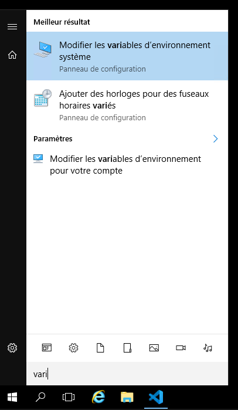
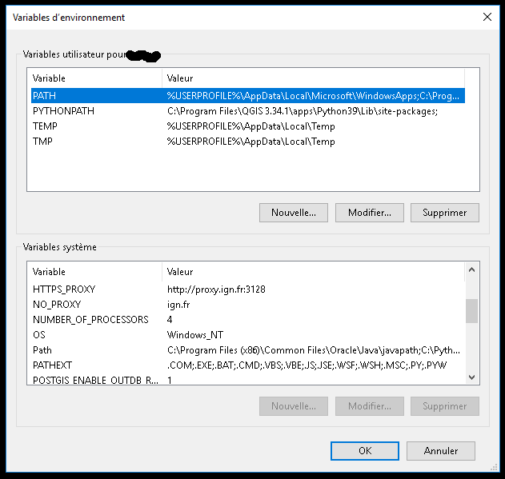

# Installing borea in the QGIS environment.

Borea is installed in the QGIS environment using pip.

## Compatibility

You need to be aware of the compatibility of python versions and python libraries.
- python >= 3.9
- gdal >= 3.3.2
- numpy <= 1.26.4

Check that your QGIS uses a version of python higher than 3.9 .  
To see this: 
- you can open QGIS and click on *Help*, then *About* you should see the version of python and GDAL. 
- If not, go to the **C:\Program File\QGIS{n°version}\apps** folder, where you'll find a **Pyhton{n°version}** folder.  
If you want to know more about the python version and libraries. Enter the folder, open a terminal in this folder (type cmd in the path bar), then in the terminal type `python --version` for the python version and `python -m pip list` to see the python libraries linked to QGIS.

## Installation by linking the QGIS environment to your terminal

To do this, you need the path to the QGIS python folder, which should look like **C:\Program File\QGIS{n°version}\apps\Python{n°version}** and inside you'll find a python executable, a Scripts folder, Lib ... and in the Lib folder a site-package or ...-package folder containing folders for python libraries such as numpy.

### Temporary link (just in the open terminal)

The first step is to add the Windows paths to the QGIS python environment.  
In a terminal (anywhere):
```
set PATH=C:\Program Files\QGIS 3.34.1\apps\Python39\;C:\Program Files\QGIS 3.34.1\apps\Python39\Scripts;%PATH%
```
**Warning**, change the paths according to your needs - this is just an example

Second step, link the python:
```
set PYTHONPATH=C:\Program Files\QGIS 3.34.1\apps\Python39\Lib\site-packages
```

Now, in the terminal, when you type `python` you're using QGIS python, similarly with `pip`, `pip list` which you'll need to return QGIS python packages.  
This command only works in the current terminal; if you open another terminal, the commands will be linked to the python installed on the machine or not found if you don't have python (easy to check with `python --version` if the python versions between your machine and QGIS are different).

You can now install ign-borea (**Please note**, this command will be permanent, so you can open QGIS afterwards and type `import borea` in the python console).
```
pip install ign-borea
```
And use linked executables (However, executables are not permanent but linked to the terminal).

This method also allows you to install other python packages that can be used in the QGIS python console.

### Permalink

To establish a permanent link that can be accessed from any terminal. You need to add links to the Path variable and create the PYTHONPATH variable.  
Open system environment variables (Windows key, then type `variable`)  
  
If the computer has several accounts, you can change the variables just for your account, otherwise change the system variables directly.  
**Warning**, system variables are read before user variables. So if python is already installed and there's a C:\Python path in the system variable path, the python used will be that of the computer and not that of QGIS.  
**Warning**, do not make any mistakes in the system variable paths, as this could lead to a system error, which could cause your computer to crash.  
  
The paths must be added to the Path variable:
- C:\Program Files\QGIS 3.34.1\apps\Python39\
- C:\Program Files\QGIS 3.34.1\apps\Python39\Scripts

And create a new PYTHONPATH variable with the path C:\Program Files\QGIS 3.34.1\apps\Python39\Lib\site-packages

**Warning**, change the paths according to your needs - this is just an example.

You can open a terminal and use the `python` and `pip` commands, which will be linked to your QGIS environment. You can check with `python --version` to see if you have the QGIS python version, or core `pip list` to see all the python libraries used by QGIS

All you have to do is:
```
pip install ign-borea
```
to use it in QGIS with executables.

## Link details

- C:\Program Files\QGIS 3.34.1\apps\Python39\ : allows you to use QGIS python with the `python` command.
- C:\Program Files\QGIS 3.34.1\apps\Python39\Scripts: use executables linked to this environment (e.g. `opk-to-opk -h` or `pip` this is what allows you to make a pip list and see the QGIS python environment).
- C:\Program FilesQGIS 3.34.1apps\Python39\Lib\site-packages : allows you to link python packages from the QGIS environment to python (borea, numpy, ...).

 